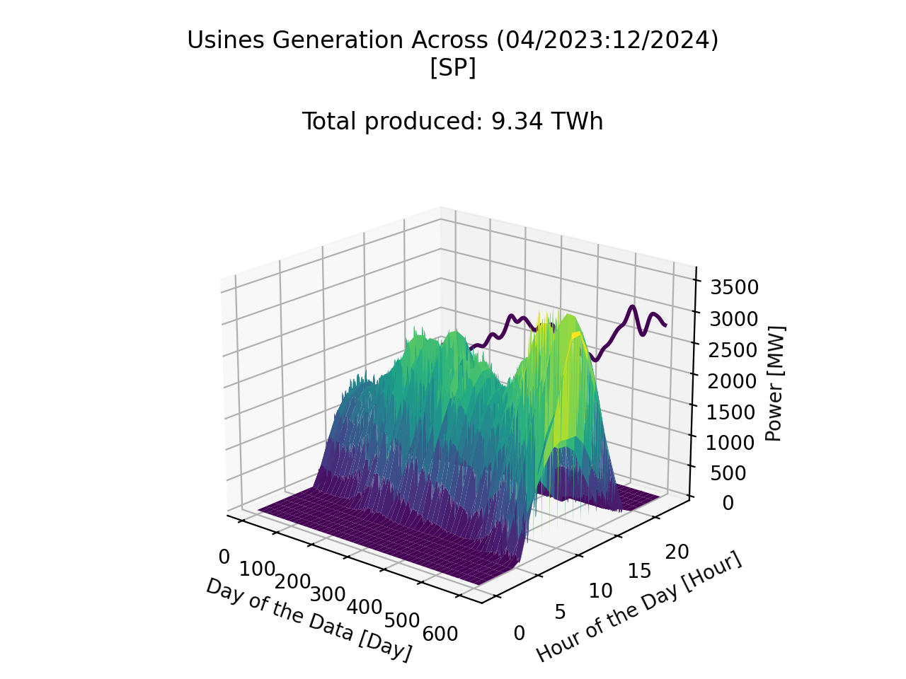

# MMD PV Generation Comparison
(ANS Estimates and ANEEL Ventures data)

Preview:

  
  
</div

*[Hourly solar radiation vs. generation capacity  (Sample photovoltaic venture (São Paulo, Brazil)) | ANS Estimates for SP]*  

---
